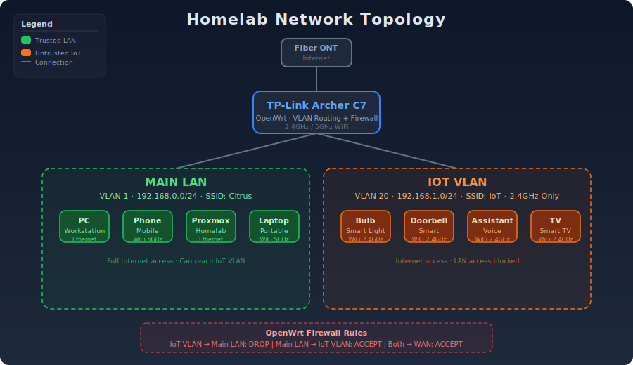

# 🏠 Homelab

A single-node home lab built on a repurposed PC, running Proxmox as the hypervisor with a mix of VMs, LXC containers, and Docker workloads.

  

---

## 📋 Overview

| | |
|---|---|
| **Hardware** | 1x repurposed PC |
| **Hypervisor** | Proxmox VE 9 |
| **Workloads** | 30+ VMs / LXC containers, Docker inside several |
| **Network** | TP-Link Archer C7/OpenWrt, TP-Link TLSG105PE  |
| **Uptime target** | 24x7 |

This lab started as a way to self-host services, and has grown into a small self-hosted platform for media, home automation, dev/test, backups, etc..

---

## 🖥️ Hardware

Repurposed PC:
| Component | Spec |
|---|---|
| CPU | i5-6400 |
| RAM | 32GB DDR4 |
| Storage | 1TB NVMe boot + 1+2TB backup/media storage |
| GPU | GTX 1060 — passed through for transcoding |
| Network | Onboard 1GbE |

---

## 🧱 Virtualization Layer — Proxmox VE

Proxmox is installed directly on bare metal and hosts everything below.

- **Storage backend:** LVM-thin / directory
- **Networking:** Linux bridge — see [Network](#-network)
- **Backup method:** vzdump to internal and external (off premise) drive

### VMs & LXC Containers

| Name | Type | Purpose | OS |
|---|---|---|---|
| Wireguard | LXC | VPN | Debian |
| Mediaserver | LXC | Media server / file storage | Debian |
| Pi-hole | LXC | DNS filtering | Debian |
| Docker | LXC | Docker containers | Debian |
| changedetection | LXC | Monitors websites for changes | Debian |
| Nginx proxy manager | LXC | reverse proxy | Debian |
| Frigate | LXC | CCTV monitoring | Debian |
| mqtt | LXC | Home automation protocol | Debian |
| Caliweb | LXC | Calibre Web | Debian |
| Home Assistant | VM | Home automation platform | HAOS |
| Grafana | LXC | Data visualization | Debian |
| Prometheus | LXC | Event monitoring | Debian |
| Kali | LXC | Pen testing | Kali Linux |
| Homepage | LXC | Services overview | Debian |
| Commafeed | LXC | RSS feed | Debian |
| Windows | VM | Windows Server testing (AD, GPO, RDS) | Windows Server 2022 |

## 📦 Containerized Services (Docker)

Docker runs inside the dedicated LXC above. Most services were previously running in Docker, but were migrated to LXC for lower overhead and better proxmox integration. Docker is retained for services with complex dependency trees or official Docker-only recommendations.

| Service | Purpose | Runs On |
|---|---|---|
| Joplin server | Note sync | Docker |
| Redlib | Reddit frontend | Docker |
| Immich | Photo backup | Docker |

Compose files are organized as:
```
docker/
├── Joplin server/
│   └── docker-compose.yml
├── Redlib/
│   └── docker-compose.yml
└── Immich/
    └── docker-compose.yml
```


## 🌐 Network

| | |
|---|---|
| **Router/Firewall** | OpenWrt |
| **Switch** | Managed, TLSG105PE |
| **Wi-Fi** | Archer C7 Router, Deco Mesh M4 AP  |
| **VLANs** | Management, Homelab, IoT, Guest |
| **DNS/Ad-blocking** | Pi-hole, running as LXC above |
| **Remote access** | WireGuard |

## 🔒 Security

| Layer | Control |
|:---|:---|
| Network segmentation | 1 VLAN to isolate IoT, planned expansion for for server and management traffic |
| Remote access | WireGuard only; no services exposed to the internet |
| DNS filtering | Pi-hole blocks ads/malware at the network level |
| Encryption | TLS via Let's Encrypt for internal services; VPN tunnel for remote access |
| Host hardening | Proxmox web UI restricted to management VLAN; SSH key-based auth, root login disabled |

Running LXC containers with privileged flags (required for some bind mounts) increases attack surface vs. unprivileged containers. Evaluating Proxmox Backup Server as part of recovery hardening.

### Reverse Proxy / Access

- **Reverse proxy:** Nginx Proxy Manager
- **TLS:** Let's Encrypt via DNS challenge
- **External exposure:** None — LAN + VPN only

---

## 💾 Backups & Disaster Recovery

Since this is a single point of failure, backups matter more than usual here:

| What | Method | Frequency | Destination |
|---|---|---|---|
| VM/LXC snapshots | vzdump | Daily incremental, weekly full; ~250GB total backup set | local disk + cloud |
| Docker volumes/configs | rsync | Daily | My PC + cloud |
| Documentation & IaC | Git | On change | GitHub (this repo) |

**Recovery plan:** Proxmox host rebuild from ISO + restore latest vzdump backups; Docker configs pulled from PC. Restore can take up to ~12 hours from cloud, ~1 hour onsite.

---

## 🛠️ Monitoring

- Grafana + Prometheus for service and resource monitoring
- Notification method —  Ntfy alerts on service downtime

---

## 🎯 Skills Demonstrated

| Skill | Experience |
|:---|:---|
| Virtualization | Proxmox VE, VMs/LXC, GPU passthrough |
| Linux | Debian administration, shell scripting, systemd, troubleshooting |
| Networking | VLANs, OpenWrt, WireGuard, DNS, firewall configuration |
| Docker | Docker Compose, networking, persistent volumes |
| Reverse Proxy | Nginx Proxy Manager, TLS, Let's Encrypt |
| Monitoring | Prometheus, Grafana, ntfy alerts |
| Backup & Recovery | Proxmox backups, rsync, recovery documentation |
| Security | Network segmentation, VPN-only access, Pi-hole/Unbound |
| Hardware | Home server build, storage planning, GPU passthrough |

## 🗺️ Roadmap

- [ ] Add Proxmox Backup Server
- [ ] Move DNS to VLAN-isolated LXC
- [ ] Automate backup testing
- [ ] Separate VLAN for server
- [ ] ...

---

## 📸 Screenshots / Diagram




